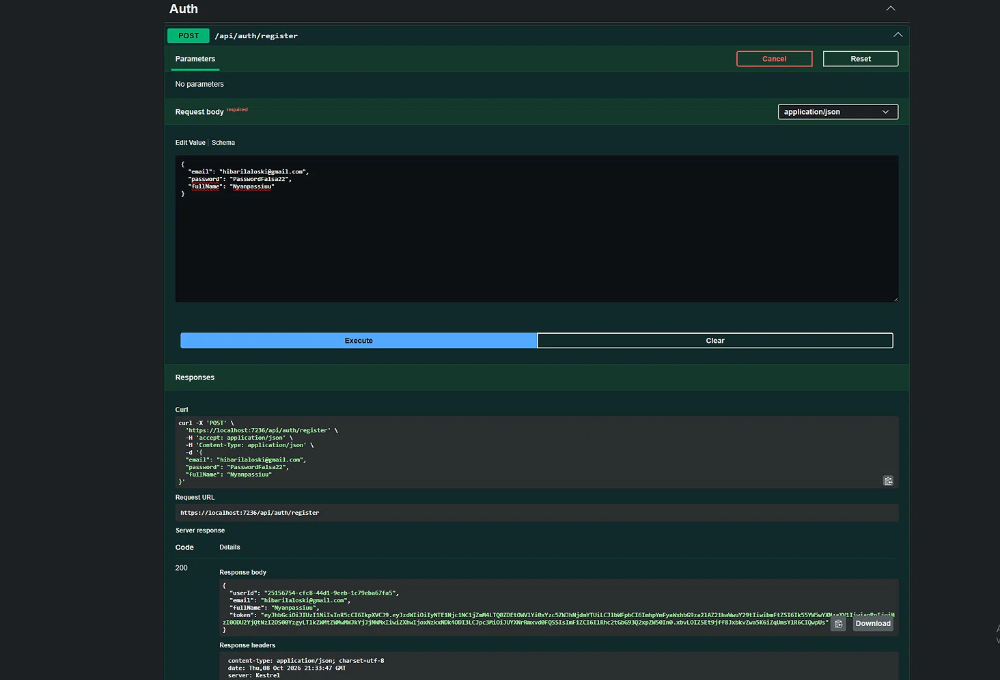
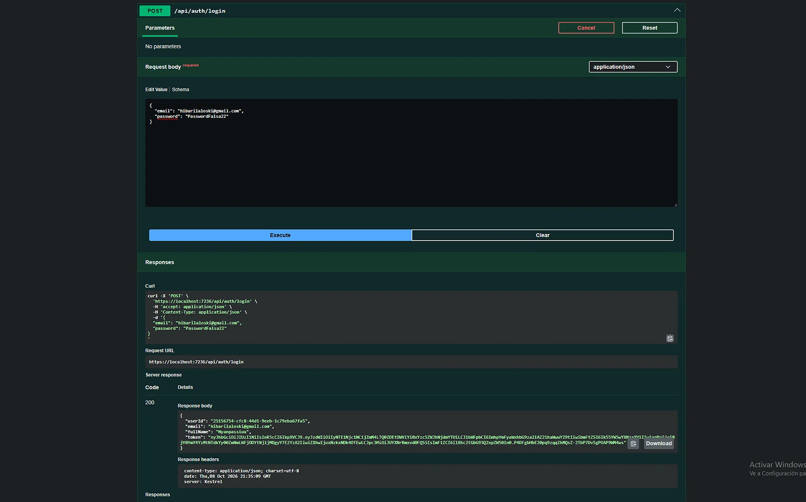
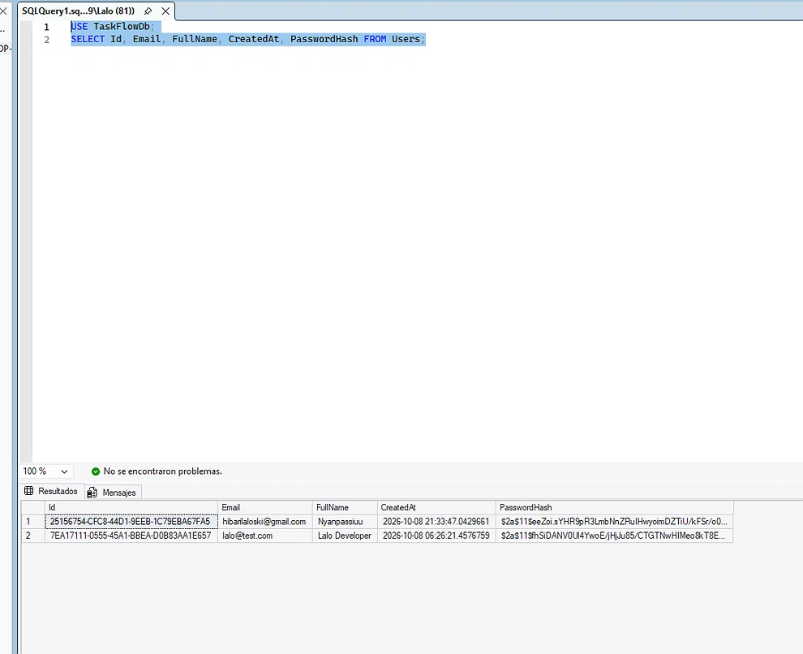
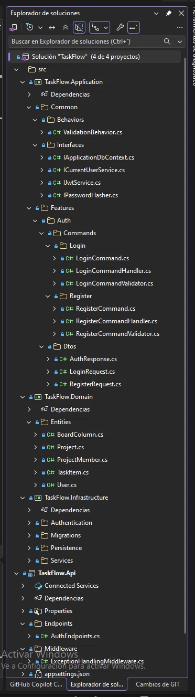

# TaskFlow 🚀

Gestor de proyectos y tareas tipo Trello/Notion, construido con **.NET 10** aplicando **Clean Architecture**, **CQRS** y **JWT Authentication**.

[](https://dotnet.microsoft.com/)
[](https://www.microsoft.com/sql-server)
[](https://opensource.org/licenses/MIT)

---

## 📋 Tabla de contenidos

- [Sobre el proyecto](#-sobre-el-proyecto)
- [Stack tecnológico](#-stack-tecnológico)
- [Arquitectura](#️-arquitectura)
- [Funcionalidades](#-funcionalidades)
- [Screenshots](#-screenshots)
- [Cómo correrlo](#-cómo-correrlo)
- [Roadmap](#️-roadmap)
- [Autor](#-autor)

---

## 🎯 Sobre el proyecto

TaskFlow es una API REST que permite gestionar proyectos, columnas y tareas al estilo Kanban (Trello). El objetivo del proyecto es demostrar buenas prácticas de desarrollo backend con .NET:

- **Clean Architecture** con separación estricta de responsabilidades.
- **CQRS** con MediatR para casos de uso desacoplados.
- **FluentValidation** con pipeline automático.
- **JWT** para autenticación stateless.
- **BCrypt** para hashing seguro de contraseñas.
- **Entity Framework Core** con configuraciones Fluent API.

---

## 🛠️ Stack tecnológico

### Backend
| Tecnología | Uso |
|---|---|
| **.NET 10** | Framework principal |
| **ASP.NET Core Minimal APIs** | Endpoints HTTP |
| **Entity Framework Core 10** | ORM |
| **SQL Server 2025** | Base de datos |
| **MediatR** | Patrón CQRS |
| **FluentValidation** | Validación de comandos |
| **JWT** | Autenticación |
| **BCrypt.Net-Next** | Hash de contraseñas |
| **Swagger / OpenAPI** | Documentación de la API |

### Próximamente
- **SignalR** (actualizaciones en tiempo real)
- **React + TypeScript** (frontend)
- **Docker** + **GitHub Actions**
- **Tests** con xUnit

---

## 🏛️ Arquitectura

El proyecto sigue **Clean Architecture**, con las dependencias apuntando siempre hacia el centro:
┌─────────────────────────────────────────┐
│ TaskFlow.Api │ ← Endpoints, DI, Middlewares
├─────────────────────────────────────────┤
│ TaskFlow.Infrastructure │ ← EF Core, JWT, BCrypt
├─────────────────────────────────────────┤
│ TaskFlow.Application │ ← Casos de uso, MediatR, DTOs
├─────────────────────────────────────────┤
│ TaskFlow.Domain │ ← Entidades, reglas de negocio
└─────────────────────────────────────────┘

### Estructura de carpetas

TaskFlow/
├── TaskFlow.Domain/
│ └── Entities/ → User, Project, ProjectMember, BoardColumn, TaskItem
│
├── TaskFlow.Application/
│ ├── Common/
│ │ ├── Behaviors/ → ValidationBehavior (FluentValidation)
│ │ └── Interfaces/ → IApplicationDbContext, IJwtService, IPasswordHasher, ICurrentUserService
│ └── Features/
│ └── Auth/
│ ├── Commands/
│ │ ├── Register/
│ │ └── Login/
│ └── Dtos/
│
├── TaskFlow.Infrastructure/
│ ├── Authentication/ → JwtService, PasswordHasher, JwtSettings
│ ├── Persistence/ → ApplicationDbContext + Configurations
│ └── Services/ → CurrentUserService
│
└── TaskFlow.Api/
├── Endpoints/ → AuthEndpoints
└── Middleware/ → ExceptionHandlingMiddleware


---

## ✅ Funcionalidades

### Implementadas
- [x] Registro de usuarios con validación
- [x] Login con generación de JWT
- [x] Hash de contraseñas con BCrypt
- [x] Validación automática con FluentValidation (pipeline de MediatR)
- [x] Manejo global de excepciones con respuestas JSON estructuradas
- [x] Swagger / OpenAPI documentado

### En desarrollo
- [ ] CRUD de Proyectos
- [ ] CRUD de Columnas
- [ ] CRUD de Tareas
- [ ] Mover tareas entre columnas
- [ ] SignalR (tiempo real)
- [ ] Roles y permisos por proyecto

---

## 📸 Screenshots

### Swagger UI


### Register exitoso


### Login exitoso


### Usuarios en la base de datos (con password hasheado)


### Estructura del proyecto


---

## 🚀 Cómo correrlo

### Requisitos previos
- [.NET 10 SDK](https://dotnet.microsoft.com/download/dotnet/10.0)
- [SQL Server Express o superior](https://www.microsoft.com/sql-server/sql-server-downloads)
- [SQL Server Management Studio (SSMS)](https://aka.ms/ssmsfullsetup) *(opcional)*

### Pasos

1. **Clonar el repositorio:**
   ```bash
   git clone https://github.com/JacevedoEspindola/taskflow.git
   cd taskflow

2. **Configurar la cadena de conexión en TaskFlow.Api/appsettings.json :**
   
   "ConnectionStrings": {
  "DefaultConnection": "Server=localhost\\SQLEXPRESS;Database=TaskFlowDb;Trusted_Connection=True;TrustServerCertificate=True;MultipleActiveResultSets=true"}

3. **Aplicar migraciones:**
   
   dotnet ef database update -p TaskFlow.Infrastructure -s TaskFlow.Api

4. **Correr la API:**

   dotnet run --project TaskFlow.Api

5. **Abrir Swagger:**

   https://localhost:7236/swagger6.  


###Probar la autenticación

##Registro:

POST /api/auth/register
Content-Type: application/json

{
  "email": "user@test.com",
  "password": "Password123",
  "fullName": "Test User"
}

##Login:

POST /api/auth/login
Content-Type: application/json

{
  "email": "user@test.com",
  "password": "Password123"
}

🗺️ Roadmap
☑ Fase 1: Setup + Clean Architecture
☑ Fase 2: Autenticación (Register + Login + JWT)
□ Fase 3: CRUD de Proyectos
□ Fase 4: CRUD de Columnas y Tareas
□ Fase 5: SignalR (tiempo real)
□ Fase 6: Frontend React + TypeScript
□ Fase 7: Docker + CI/CD + Deploy

👤 Autor
Jose Acevedo

GitHub: @JacevedoEspindola

📄 Licencia
Este proyecto está bajo la licencia MIT. Ver LICENSE para más detalles.


---

